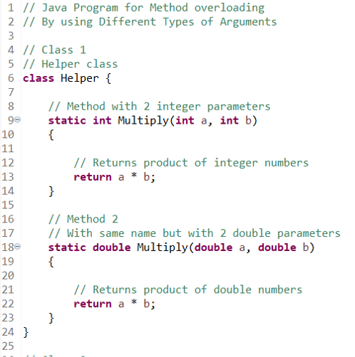
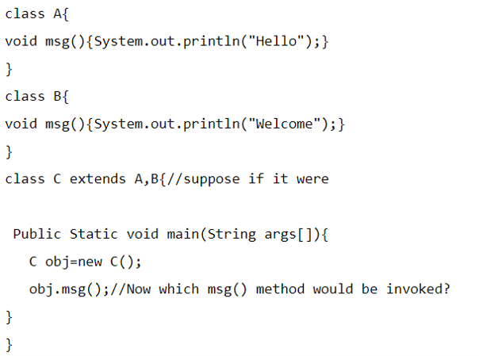
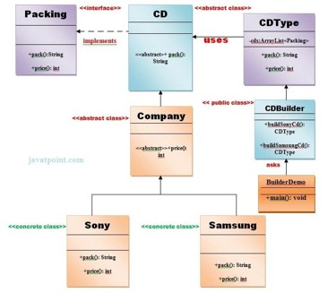
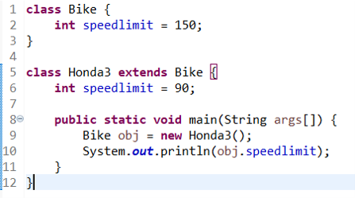
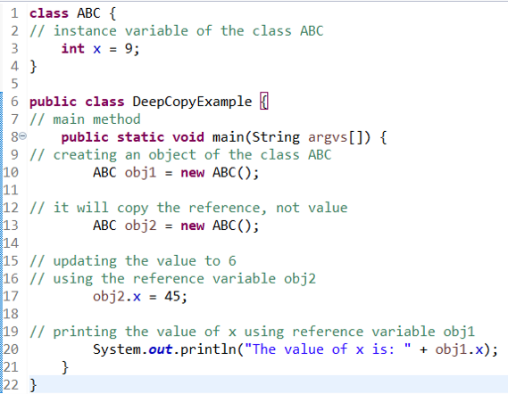
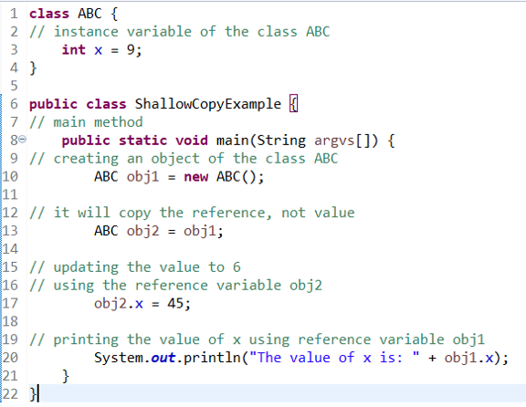
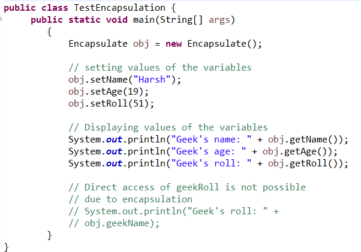
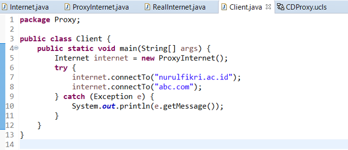
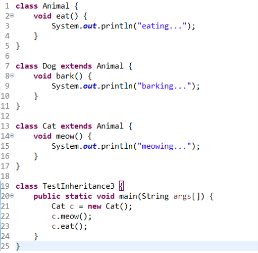

# Ayyash Mumtaz Hafizh - GRADE 75.00/100.00

### Soal 1

Pemanfaatan metode abstract parent class lebih efisien karena fungsi di dalam kelas lebih reusable dibandingkan dengan metode interface.

Select one:
True
False ✅

### Soal 2

Apabila perintah "static" pada function multiply (line 9 dan 18) dihapus, apa hasil dari program ini?

a. null
null
b. 8
34.65
c. Program Error sebelum dicompile ✅
d. 8
8

### Soal 3

Pada studi kasus berikut, yg menjadi Wrapper class adalah kelas?

a. BankDetails
b. AdapterPatternDemo
c. BankCustomer ✅
d. CreditCard

### Soal 4

Metode shallow copy lebih baik digunakan jika target objek yang akan dikloning hanya mempunyai tipe field primitive (integer, float, double, dll.)

Select one:
True
False ✅

### Soal 5

Apa hasil dari source code ini?

a. Error sebelum dicompile ✅
b. Error saat dicompile
c. Hello
d. Hello Welcome

### Soal 6

Kelas apa saja yang terdampak perubahan ketika kita menambahkan produk baru pada pattern Buiilder?

a. Penambahan Kelas Baru, CDBuilder, dan CDType
b. Penambahan Kelas Baru, Company, dan Packing
c. Penambahan Kelas Baru, CDType, dan Company
d. Penambahan Kelas Baru, CDBuilder, dan BuilderDemo ✅

### Soal 7

Apa yang akan dihasilkan oleh kelas TestEncapsulation:

Apabila method getter dan setter pada kelas Encapsulate diset menjadi "private"?

a. Geek's name: null Geek's age: null Geek's roll: null
b. Program Error saat dicompile ✅
c. Geek's name: Harsh Geek's age: 19 Geek's roll: 51
d. null

### Soal 8

Kelebihan dari proses lazy initialization adalah proses start aplikasi akan lebih cepat jika dibandingkan dengan eager initiatilization.

Select one:
True ✅
False

### Soal 9

Apa hasil dari program di bawah ini?

a. 150 ✅
b. Error pada line 10
c. Error pada line 9
d. 90

### Soal 10

Metode interface dapat digunakan jika terdapat lebih dari satu kelas provider yang dibutuhkan oleh client.

Select one:
True ✅
False

### Soal 11

Proses deep copy pada metode prototype akan mengkloning semua objek sampai dengan semua reference dari objek tersebut.

Select one:
True ✅
False

### Soal 12

Perubahan yg benar jika client ingin menambahkan requirement baru pada studi kasus adapter di atas adalah..

a. Penambahan abstrak kelas baru terkait requirement baru tersebut
b. Penambahan kelas adapter baru terkait requirement baru tersebut
c. Penambahan interface baru terkait requirement baru tersebut ✅
d. Penambahan kelas adaptee baru terkait requirement baru tersebut

### Soal 13

Berapakah value akhir dari obj1.x hasil implementasi deep copy berikut ini?

a. Error sebelum dicompile karena terdapat dua kali instansiasi object
b. 45 ✅
c. 9
d. Error sebelum dicompile karena hak akses atribut x bukan private

### Soal 14

Pada suatu class diagram metode Builder diimplementasikan dengan tanda panah tipe generalization dari kelas ConcreteBuilder ke kelas Builder.

Select one:
True
False ✅

### Soal 15

Berapa nilai akhir dari obj1.x hasil implementasi dari shallow copy berikut?

a. Error sebelum dicompile karena terdapat dua kali instansiasi object
b. 45
c. 9 ✅
d. Error sebelum dicompile karena hak akses atribut x bukan private

### Soal 16

Apa yang akan dihasilkan oleh kelas TestEncapsulation:

Apabila atribut pada kelas Encapsulate diset menjadi "protected"?

a. null
b. Program Error saat dicompile
c. Geek's name: null Geek's age: null Geek's roll: null
d. Geek's name: Harsh Geek's age: 19 Geek's roll: 51 ✅

### Soal 17

Perhatikan implementasi pola proxy berikut, jika pada kelas ProxyInternet, variabel list bannedSItes ditambahkan item (bannedSites.add("nurulfikri.ac.id");

maka output dari kelas client berikut adalah...

a. Error, exceeded character
b. Connecting to nurulfikri.ac.id
Access Denied
c. Access Denied
Connecting to abc.com
d. Access Denied ✅

### Soal 18

Konsep dari metode singleton adalah memastikan hanya ada satu instance dari suatu kelas.

Select one:
True ✅
False

### Soal 19

Jika kita ingin menambahkan fungsional baru pada pola Decorator berikut,

maka perubahan yg diperbolehkan terjadi adalah pada:

a. Penambahan kelas baru sesuai fungsionalitas yang dibutuhkan ✅
b. Tidak perlu penambahan kelas baru
c. Perubahan pada kelas decorator dengan menambahkan fungsionalitas yang dibutuhkan
d. Penambahan kelas decorator baru untuk mengakomodasi fungsionalitas yg dibutuhkan

### Soal 20

Apa hasil dari source code berikut ini, jika class Dog (line 7) ditambah keyword "final" di bagian depannya?

a. Error pada line 19
b. Error pada saat dicompile
c. Error pada line 7
d. meowing... ✅
eating...
