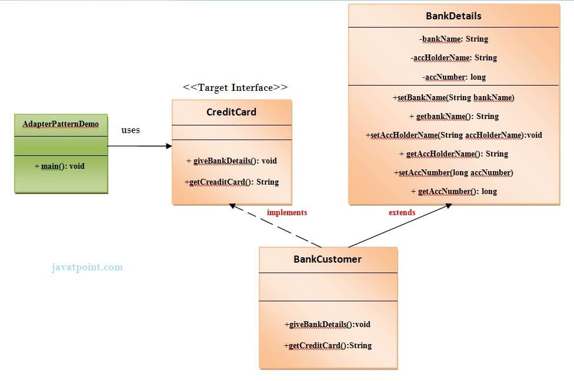
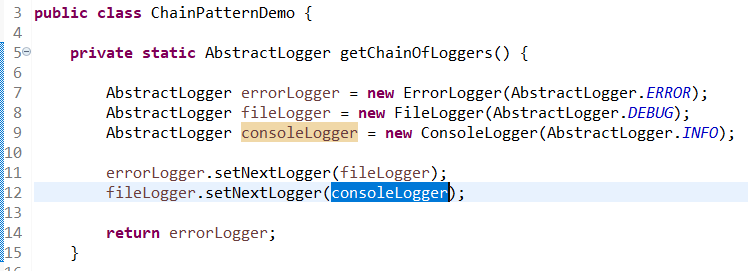
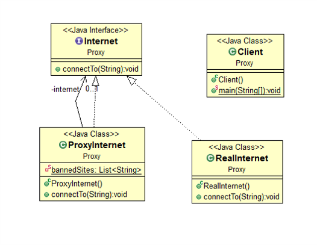
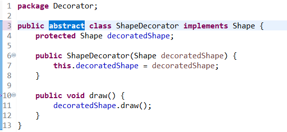
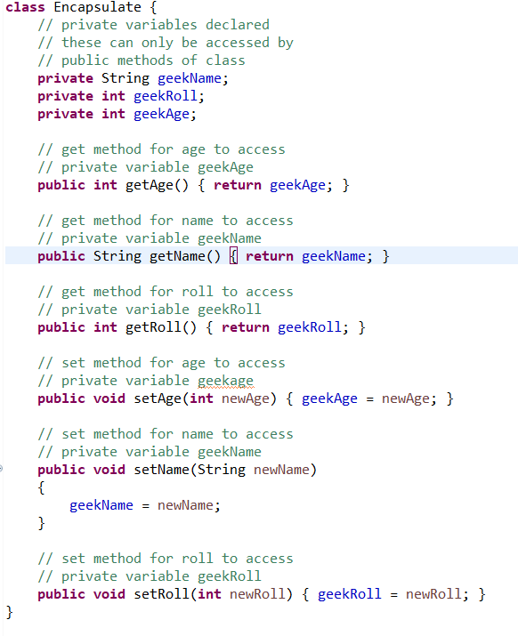
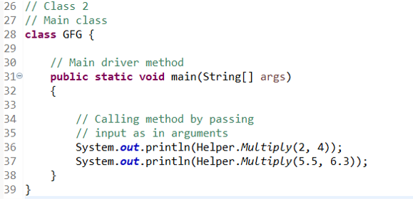
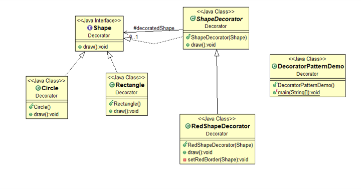

# Sulthan Raghib Fillah - GRADE 85.00/100.00

### Soal 1

Metode interface dapat digunakan jika terdapat lebih dari satu kelas provider yang dibutuhkan oleh client.

Select one:  
True ✅  
False  

### Soal 2

Pada studi kasus berikut, yg menjadi Wrapper class adalah kelas?

a. BankDetails  
b. AdapterPatternDemo  
c. BankCustomer ✅  
d. CreditCard  

### Soal 3

Apa hasil dari program di bawah ini?

a. 150 ✅  
b. Error pada line 10  
c. Error pada line 9  
d. 90  

### Soal 4

Kelas apa saja yang terdampak perubahan ketika kita menambahkan produk baru pada pattern Buiilder?

a. Penambahan Kelas Baru, CDBuilder, dan CDType  
b. Penambahan Kelas Baru, Company, dan Packing  
c. Penambahan Kelas Baru, CDType, dan Company  
d. Penambahan Kelas Baru, CDBuilder, dan BuilderDemo ✅  

### Soal 5

Metode shallow copy lebih baik digunakan jika target objek yang akan dikloning hanya mempunyai tipe field primitive (integer, float, double, dll.)

Select one:  
True ✅  
False (kata A.I. harusnya salah)  

### Soal 6

Pada suatu class diagram metode Builder diimplementasikan dengan tanda panah tipe generalization dari kelas ConcreteBuilder ke kelas Builder.

Select one:  
True  
False ✅  

### Soal 7

Apa yang terjadi jika pada line 12 keyword "consoleLogger" diganti menjadi "errorLogger"?

a. Terdapat warning pada line 9  
b. Terdapat warning pada line 12  
c. Program Error saat dicompile ✅  
d. Terdapat Error pada line 9  

### Soal 8

Apa yang akan dihasilkan oleh kelas TestEncapsulation:

Apabila method getter dan setter pada kelas Encapsulate diset menjadi "private"?

a. Program Error saat dicompile ✅  
b. null  
c. Geek's name: null Geek's age: null Geek's roll: null  
d. Geek's name: Harsh Geek's age: 19 Geek's roll: 51  

### Soal 9

Berikut ini merupakan pernyataan BENAR terkait perbedaan pola Factory dengan Builder, KECUALI?

a. Pada pola Builder bisa memanfaatkan kelas abstrak.  
b. Pada Factory disediakan opsi untuk memilih kelas mana yg akan diinstansiasi. ✅  
c. Pada pola Factory bisa memanfaatkan interface.  
d. Penambahan produk pada metode Factory berarti perlu penambahan kelas baru, tidak demikian untuk pola Builder.  

### Soal 10

Perhatikan implementasi pola proxy berikut,

Jika terdapat perubahan requirement untuk menambahkan beberapa situs yang perlu diblacklist, perubahan kode akan terjadi pada kelas apa saja?

a. Perubahan pada kelas RealInternet saja  
b. Perubahan pada kelas ProxyInternet saja ✅  
c. Perubahan pada kelas RealInternet dan interface internet  
d. Perubahan pada kelas ProxyInternet dan Client  

### Soal 11

Apa yang akan terjadi, jika keyword "abstract" pada line 3 dihapus?

a. Terdapat error sebelum program dicompile pada line 3  
b. Program masih berjalan lancar tanpa error karena semua method di interface sudah diimplementasikan pada kelas Decorator tersebut ✅  
c. Terdapat error sebelum program dicompile pada line 10  
d. Program masih berjalan lancar tanpa error karena tidak masalah untuk implementasi tipe kelas apapun untuk pola Decorator  

### Soal 12

Apa yang akan dihasilkan oleh kelas TestEncapsulation:

Apabila atribut pada kelas Encapsulate diset menjadi "protected"?

a. Geek's name: null Geek's age: null Geek's roll: null  
b. Program Error saat dicompile  
c. Geek's name: Harsh Geek's age: 19 Geek's roll: 51 ✅  
d. null  

### Soal 13

Apa hasil dari source code berikut ini, jika class Dog (line 7) ditambah keyword "final" di bagian depannya?

a. Error pada line 19  
b. Error pada saat dicompile  
c. Error pada line 7  
d. meowing... ✅  
eating...

### Soal 14

Perhatikan implementasi pola proxy berikut, jika pada kelas ProxyInternet, variabel list bannedSItes ditambahkan item (bannedSites.add("nurulfikri.ac.id");

maka output dari kelas client berikut adalah...

a. Error, exceeded character  
b. Connecting to nurulfikri.ac.id  
Access Denied  
c. Access Denied  
Connecting to abc.com  
d. Access Denied ✅  

### Soal 15

Proses deep copy pada metode prototype akan mengkloning semua objek sampai dengan semua reference dari objek tersebut.

Select one:  
True ✅  
False  

### Soal 16

Apabila perintah "static" pada function multiply (line 9 dan 18) dihapus, apa hasil dari program ini?

a. null  
null  
b. 8  
34.65  
c. Program Error sebelum dicompile ✅  
d. 8  
8  

### Soal 17

Jika kita ingin menambahkan fungsional baru pada pola Decorator berikut,

maka perubahan yg diperbolehkan terjadi adalah pada:

a. Penambahan kelas baru sesuai fungsionalitas yang dibutuhkan ✅  
b. Tidak perlu penambahan kelas baru  
c. Perubahan pada kelas decorator dengan menambahkan fungsionalitas yang dibutuhkan  
d. Penambahan kelas decorator baru untuk mengakomodasi fungsionalitas yg dibutuhkan  

### Soal 18

Kemudahan dalam proses maintenance adalah salah satu manfaat dari implementasi singleton.

Select one:  
True ✅  
False  

### Soal 19

Apa hasil dari source code ini?

a. Error sebelum dicompile ✅  
b. Error saat dicompile  
c. Hello  
d. Hello Welcome  

### Soal 20

Berapakah value akhir dari obj1.x hasil implementasi deep copy berikut ini?

a. Error sebelum dicompile karena terdapat dua kali instansiasi object  
b. 45 ✅  
c. 9  
d. Error sebelum dicompile karena hak akses atribut x bukan private  
