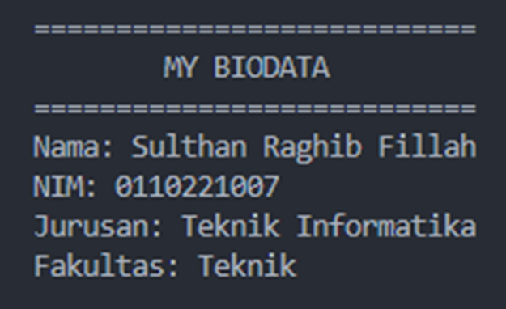

## This Code

<pre>
public class Biadata {
   public static void main(String[] args) {
      System.out.println("===========================");
      System.out.println("        MY BIODATA");
      System.out.println("===========================");
      System.out.println("Nama: Sulthan Raghib Fillah");
      System.out.println("NIM: 0110221007");
      System.out.println("Jurusan: Teknik Informatika");
      System.out.println("Fakultas: Teknik");
   }
}
</pre>

## This Output

