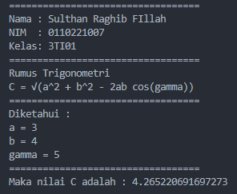

## This Code

```shell
public class MathFormula {
   public static void main(String[] args) {
      int a = 3;
      int b = 4;
      int gamma = 5;

      double hasil = Math.sqrt(Math.pow(a, 2) + Math.pow(b, 2) - (2 * a * b * Math.cos(gamma)));

      System.out.println("==================================");
      System.out.println("Nama : Sulthan Raghib Fillah");
      System.out.println("NIM  : 0110221007");
      System.out.println("Kelas: 3TI01");
      System.out.println("==================================");
      System.out.println("Rumus Trigonometri \nC = √(a^2 + b^2 - 2ab cos(gamma))");
      System.out.println("==================================");
      System.out.println("Diketahui :");
      System.out.println("a = " + a);
      System.out.println("b = " + b);
      System.out.println("gamma = " + gamma);
      System.out.println("==================================");
      System.out.println("Maka nilai C adalah : " + hasil);
   }
}
```

## This Output


