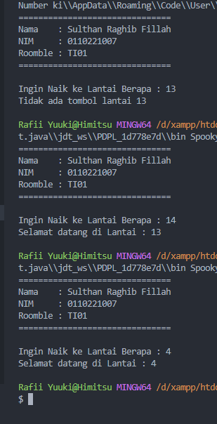

## This Code

```shell
import java.util.*;

public class SpookyNumber {
   public static void main(String[] args) {
      String ActualFloor = "Selamat datang di Lantai : ";

      Scanner input = new Scanner(System.in);
      System.out.println("===============================");
      System.out.println("Nama    : Sulthan Raghib Fillah");
      System.out.println("NIM     : 0110221007");
      System.out.println("Roomble : TI01");
      System.out.println("===============================\n");

      System.out.print("Ingin Naik ke Lantai Berapa : ");
      int floor = input.nextInt();

      if (floor == 13) {
         System.out.println("Tidak ada tombol lantai 13");
      } else if (floor >= 14) {
         System.out.println(ActualFloor + (floor - 1));
      } else {
         System.out.println(ActualFloor + floor);
      }
   }
}

```

## This Output


