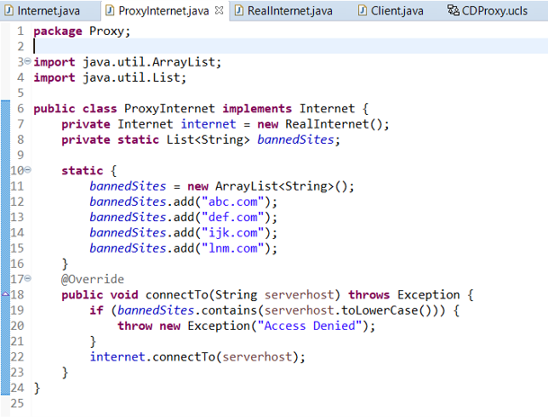

## Soal 1

Perhatikan implementasi pola proxy berikut,

Jika terdapat perubahan requirement untuk menambahkan beberapa situs yang perlu diblacklist, perubahan kode akan terjadi pada kelas apa saja?

a. Perubahan pada kelas RealInternet dan interface internet  
b. Perubahan pada kelas ProxyInternet saja ✅  
c. Perubahan pada kelas ProxyInternet dan Client  
d. Perubahan pada kelas RealInternet saja 

## Soal 2

Perhatikan implementasi pola proxy berikut, jika pada kelas ProxyInternet, variabel list bannedSItes ditambahkan item (bannedSites.add("nurulfikri.ac.id"); 

maka output dari kelas client berikut adalah...

a. Connecting to nurulfikri.ac.id  
   Access Denied  
b. Access Denied  
   Connecting to abc.com  
c. Error, exceeded character  
d. Access Denied ✅  
   Access Denied  
